== Introduction

During the demo, you will be inspecting the data regarding the implementation of a system called Graph Product Line. This SPL generates variants of a graph application that include at least one graph algorithm to compute information regarding different types of graph. The system and its variants are specified by the following feature model:

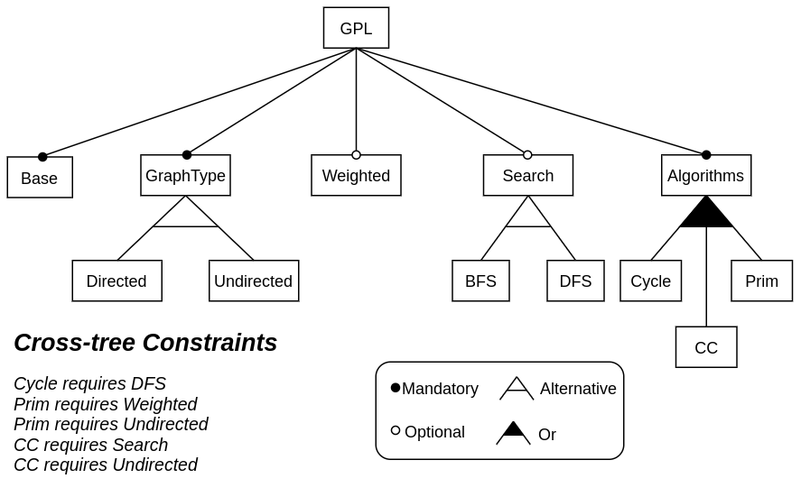

== Getting Started

The first step is to log in to the neo4j server. When you first start the browser, it should show a login prompt. Enter the following information:

* URL: `bolt://fe0f3c2f.databases.neo4j.io`
* Username: `neo4j`
* Password: `rhjFjXmAp1mAVNtiYkhqMf1hHGUdf9mRuRy9LyaGtFI`

then hit the play button.

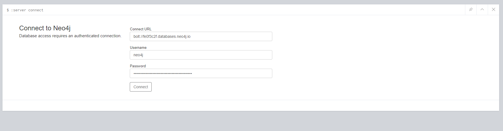

Once the connection is established, some commands will run automatically, and you should see a screen that looks like this:

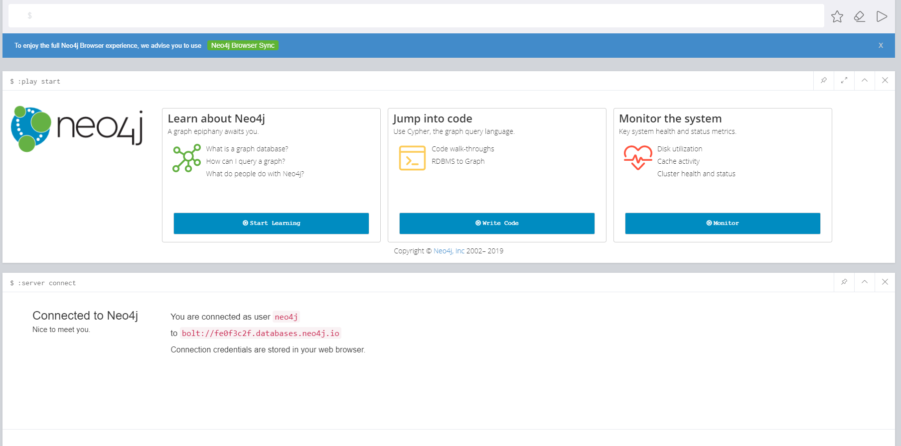

Now copy and paste this command, and click on the play button to run it.
[source, cipher]
----
Match (r) where r:cFunction or r:cClass with collect(r)[0..10] as a, collect(ID(r))[0..10] as t
CALL{
  with a,t
  unwind a as x
  match(x)-[r]-(y)
  where ID(y) in t
  return x,r,y
  }
return x,r,y
----

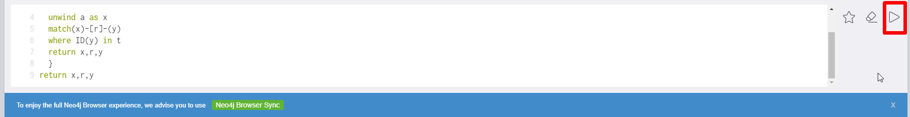

You should see a graph after the data loads.

== Overview of UI

Each command you run will open a new explorer. This is where you will do most of your work.

=== Interpreting the graph

In the graph, there are nodes and relations. Each node and relation has a type.
The node type is represented by color.
The relation type has several different representations.
The default representation shows the type along the arrow in bold text.
The other label on the arrow is the presence condition of the relation.

To move around the graph, drag with the left mouse.
To view the details of a node or relation, left click on it, and the information appears at the bottom of the explorer.
Additionally, right clicking on a relation shows its data in a box, which is convenient for long conditions.

=== Top legend

At the top of the explorer there is a legend, currently with two rows. It shows the list of node types and relation types, and total number in each type.
It also serves as a color legend for the node type. The `*` type represents all nodes/relations.

=== Style editor

If you click on an item in the legend, a style editor opens at the bottom of the explorer.

=== Bottom left legend

There is another legend at the bottom left of the screen. It is used by more advanced features explained later.

=== Going fullscreen

Click on the fullscreen button to go full screen. In the full screen view, there are two more things at the top of the screen.
On the left side is an input for filtering, and on the right side are two button groups to change aspects of the visualizations.
These are explained in later parts of the document.

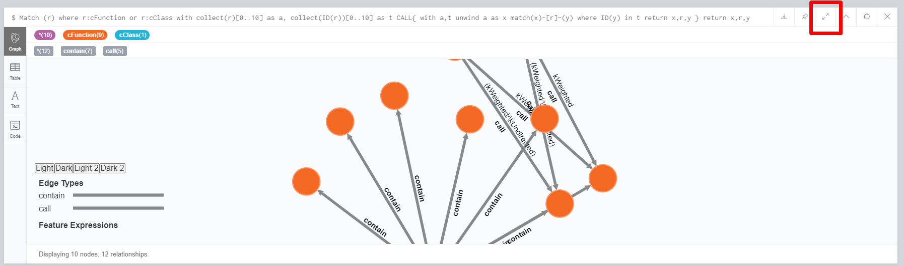

== General features

=== Visibility toggle

It is possible to hide different types of nodes and relations. To do this, click on the type in the top legend, and toggle the visibility checkbox in the style editor.

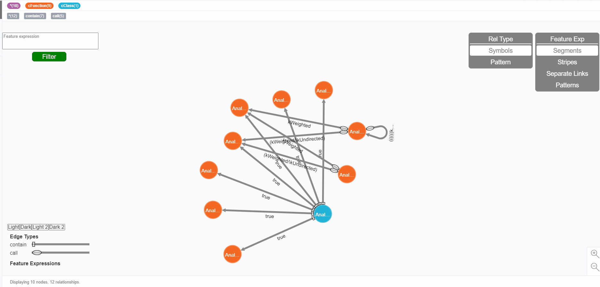

=== Filter tool

The key feature of this browser is to highlight relations based on presence condition filters. Each filter highlights the conditions that are satisfiable given the presence condition. Relations that satisfy no filter are grey.

To add a filter, type in the filter using `/\` for 'and', `\/` for 'or', and `!` for 'not'. Press add filter. Select the filter in the top legend, then select a color in the style editor for the filter to take effect.

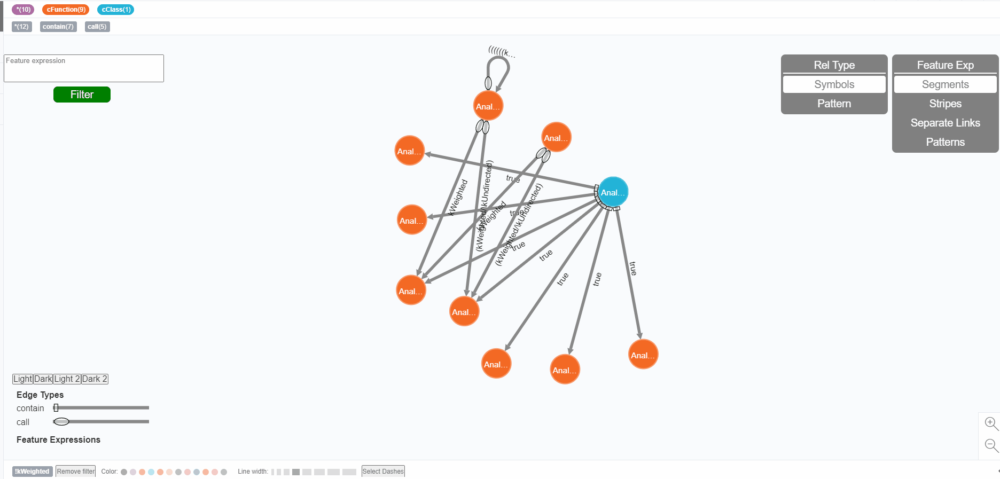

To remove a filter, select filter in the top legend, then press remove filter in the style editor.

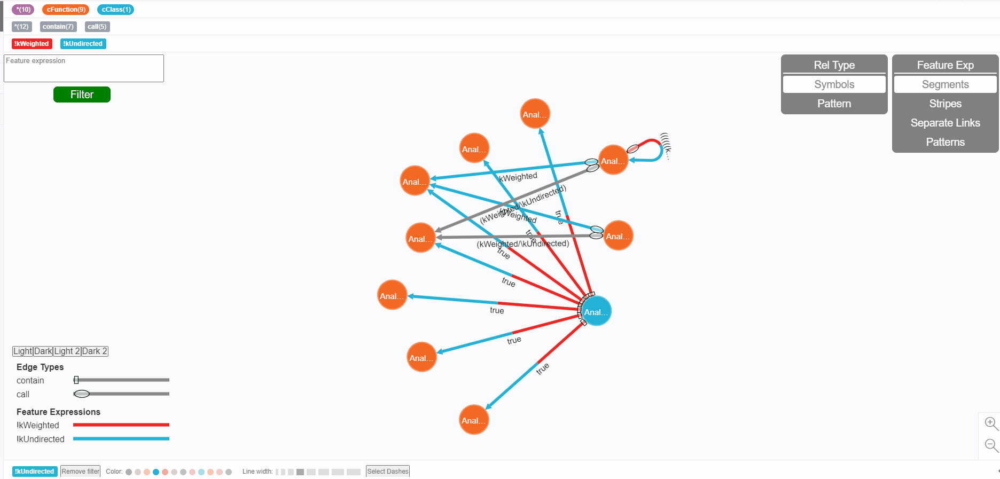

== Layout options

When the same filter applies to multiple edges, there are four different ways in which the visualizer applies these colors to each edge.
The layout is selected using the "Feature Exp" button group in the top right.

=== Segments

The default layout is segments. In this layout, each color is laid out as different segments along the arrow.

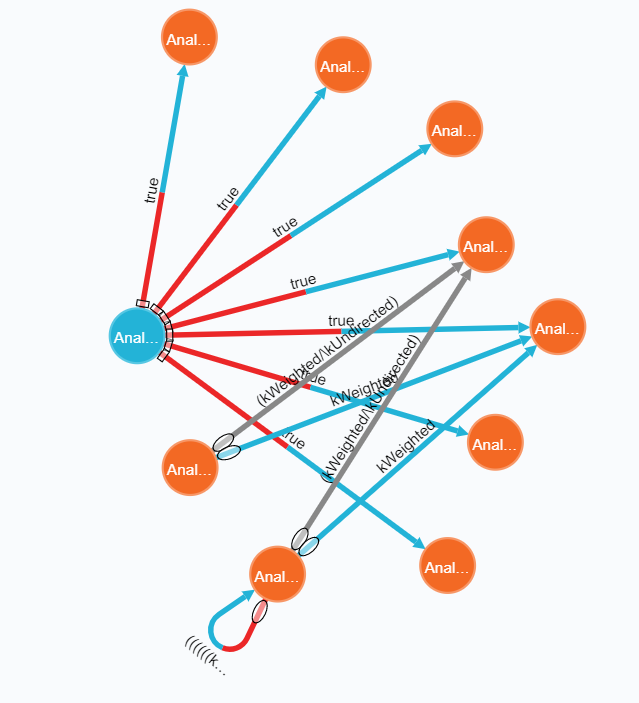

=== Stripes

In the stripes layout, the arrow is divided into multiple stripes. This layout works best with a high width.

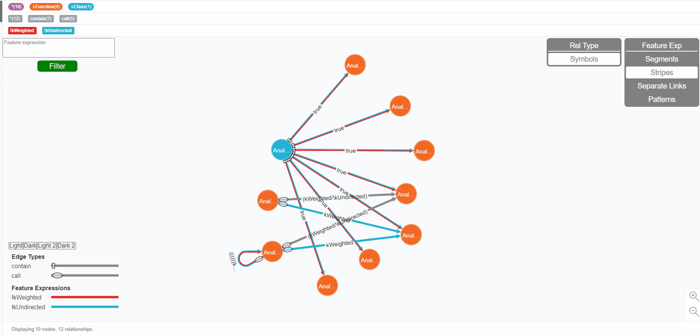

=== Separate Links

In this layout, each relation is represented by multiple links, one for each filter that it satisfies. A single grey link means that a relation satisfies no filters. The arrow width only affects the length of the arrow head in this layout.

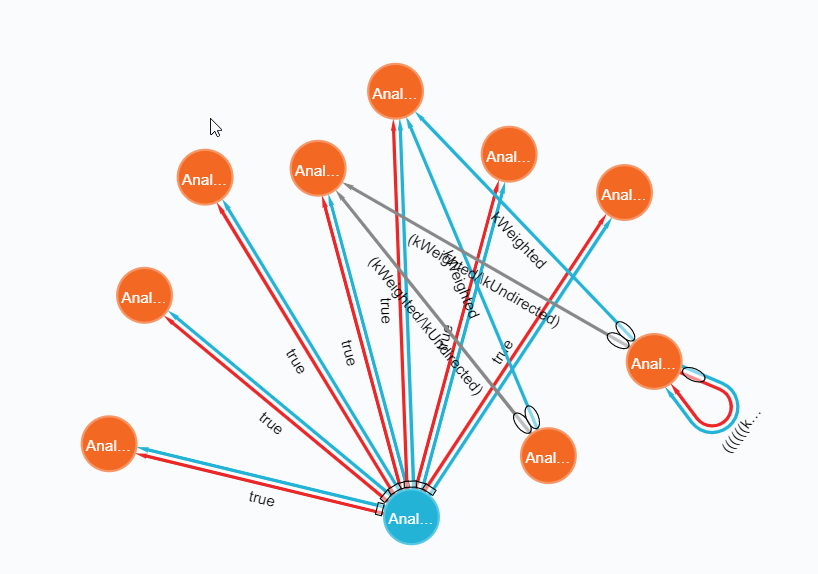

=== Patterns

This layout is based on the segments layout. In addition to colors, each filter can have a pattern assigned to it.
To select a pattern, click on the select dashes button in the style editor, and click on one of the dash patterns. To interpret the patterns, reference the legend at the bottom left.

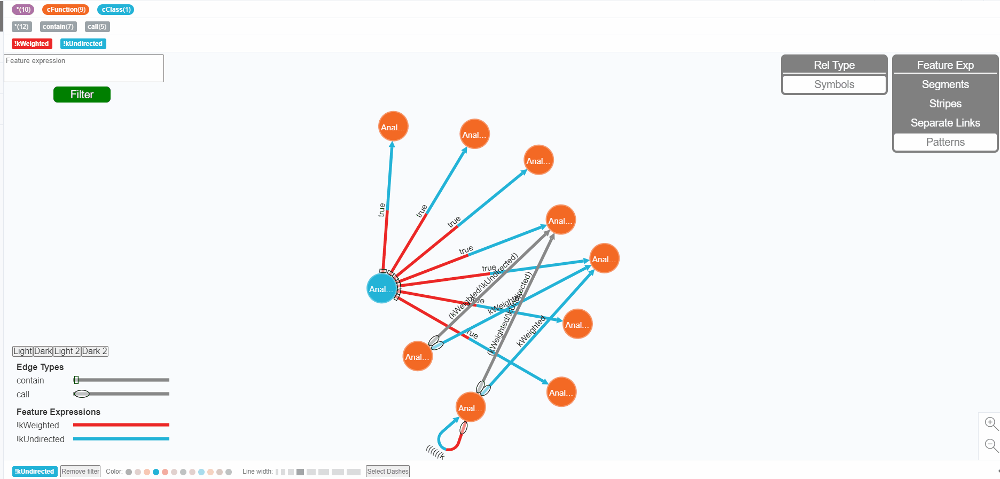

== Interpreting relation types

As colors are used to communicate presence condition filters already, other methods have to be used to identify relation types.
There are three methods, and they can be selected using the "Rel Type" button group in the top right. Not all methods are available under every layout.

=== Labels

When the labels option is selected, a bold label outside the relation identifies the type of the relation.

=== Symbols

When the symbols option is selected, each relation has a label at its start. To interpret the type of the relation, reference the legend at the bottom left of the graph.

=== Patterns

When the patterns option is selected, the type of the relation is represented by a single dash pattern across its entire length. This option is only available for the segments layout. To interpret the type of the relation, reference the legend at the bottom left of the graph.

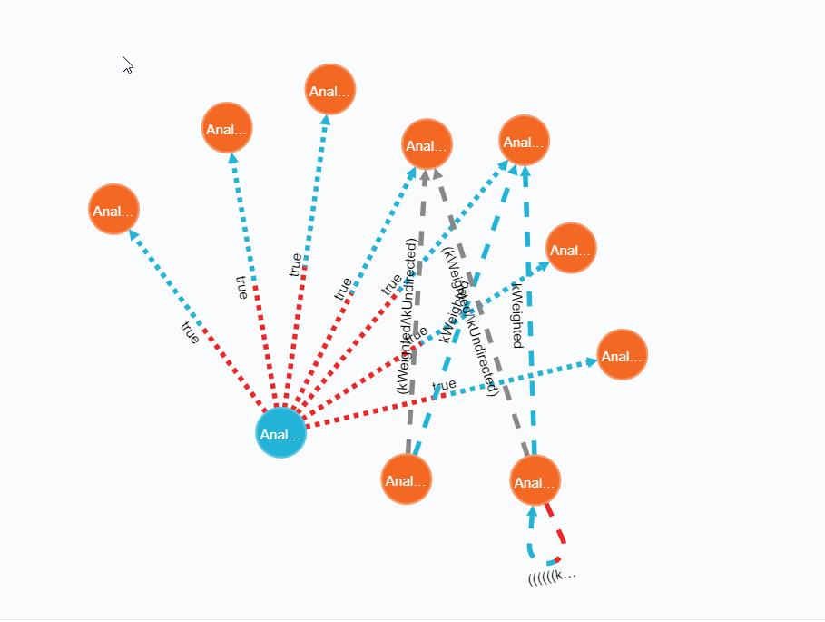

== Task 1

[source, cypher]
----
MATCH p=(n)-[r:varWrite|write|read]->(m) WHERE EXISTS(r.condition) AND r.condition <> "true" RETURN p
----

- How many varWrites in this graph may happen in a directed weight graph?
- How many reads in this graph may happen in an unweighted graph?

== Task 2

[source, cypher]
----
MATCH p=(q)-[:call]->(n:cFunction)-[r]-(m) WHERE EXISTS(r.condition) AND n.label CONTAINS "updateEdgeWeight" AND type(r) <> "call" AND type(r) <> "contain" AND type(r) <> "obj" AND type(r) <> "varInfFunc" RETURN p
----

* In which of the following feature configurations the function decl;unknownFeature;GraphApp::updateEdgeWeight(std::string,std::string,int,);; may be called AND all its data flow operations may be executed?
** kUndirected /\ kDFS /\ kCycle /\ !kDirected /\ !kWeighted /\ !kPrim /\ !kAlgorithm /\ !kConnectedComps /\ !kBFS
** kUndirected /\ kWeighted /\ kDFS /\ kCycle /\ !kPrim /\ !kConnectedComps /\ !kBFS /\ !kDirected
** kUndirected /\ kDFS /\ kConnectedComps /\ !kDirected /\ !kWeighted /\ !kPrim /\ !kBFS /\ !kCycle

== Task 3

[source, cypher]
----
MATCH p=(n)-[r:call]->(m) WHERE EXISTS(r.condition) AND n.label CONTAINS "handleCommands" RETURN p
----

* In which of the following feature configurations the function decl;unknownFeature;GraphApp::printNeighbors();; can be called by handleCommands?
** `kDirected /\ kWeighted /\ DFS /\ kCycle /\ !kPrim /\ !kConnectedComps /\ !kBFS /\ !kUndirected`
** `kUndirected /\ kWeighted /\ kDFS /\ kConnectedComps /\ kPrim /\ !kDirected /\ !kBFS /\ !kCycle`
** `kUndirected /\ kBFS /\ kConnectedComps /\ !kDirected /\ !kWeighted /\ !kPrim /\ !kDFS /\ !kCycle`

== Task 4

[source, cypher]
----
MATCH p=(n)<-[r:read]-(m) RETURN p
----

* How many READ edges may execute in FC1 but are not present in FC2?
** FC1: `kUndirected /\ kWeighted /\ kDFS /\ kCycle /\ kPrim /\ !kDirected /\ !kConnectedComps /\ !kBFS`
** FC2: `kUndirected /\ kDFS /\ kCycle /\ kConnectedComps /\ !kDirected /\ !kWeighted /\ !kPrim /\ !kBFS`

== Task 5

[source, cypher]
----
MATCH p=(n)<-[r:write]-(m) RETURN p
----

* How many WRITE edges may execute in FC3 but are not present in FC4?
** FC3: `kUndirected /\ kWeighted /\ kDFS /\ kCycle /\ !kDirected /\ !kPrim /\ !kConnectedComps /\ !kBFS`
** FC4: `kUndirected /\ kWeighted /\ kBFS /\ kConnectedComps /\ kPrim /\ !kDirected /\ !kDFS /\ !kCycle`
